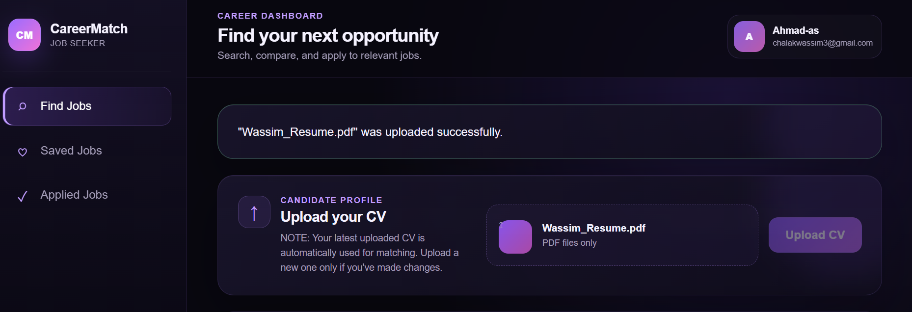
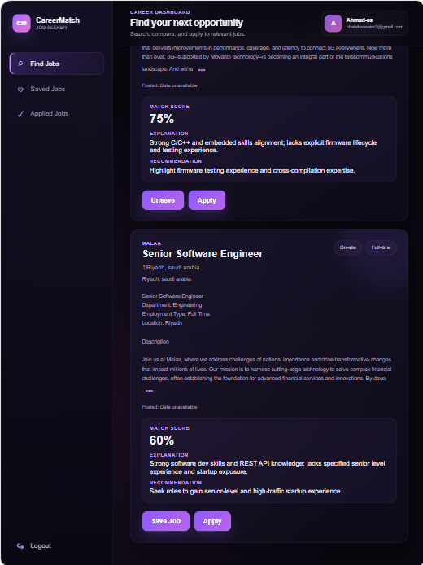
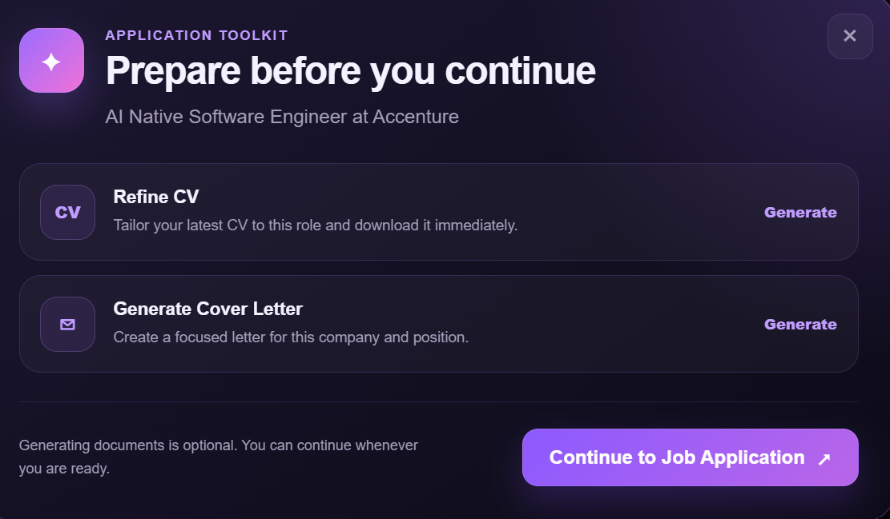
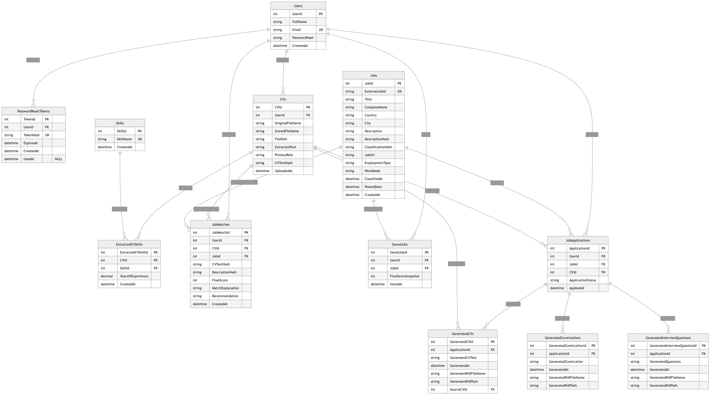

# CareerMatch

### AI-Powered Job Search & Application Platform

CareerMatch is a full-stack web application designed to help job seekers discover opportunities based on their preferences, understand how well their CV matches specific jobs, and prepare stronger job applications using AI.

The platform was developed during my full-time Full-Stack Development internship at **Computer Technology & Services (CTServ)**.

🌐 **Live Application:** https://career-match-iota.vercel.app/

---

## Overview

CareerMatch brings the major stages of the job-search and application process into one platform.

Users can:

- Upload and analyze their CV
- Search for jobs based on role, country, city, employment type, and work mode
- Calculate AI-powered CV-to-job match scores
- Discover their best-matching opportunities
- Save jobs for later
- Refine their CV for a specific position
- Generate tailored cover letters
- Track jobs they have applied to
- Prepare for interviews with job-specific AI-generated questions

---

## Screenshots

### Landing Page

.png)

.png)

### CV Upload & Analysis



### AI-Powered Best Matches



### Before You Apply



---

## How CareerMatch Works

### 1. CV Upload & Analysis

Users begin by uploading their CV as a PDF.

CareerMatch:

- Validates and stores the uploaded PDF
- Extracts its text using **PdfPig**
- Normalizes the extracted content
- Generates a SHA-256 hash of the CV text
- Uses **OpenAI** to extract the candidate's primary role, skills, and years of experience
- Stores the structured CV information in Microsoft SQL Server

The extracted information is later used when the user requests CV-to-job matching.

Job matching is intentionally **not performed during CV upload**.

---

### 2. Preference-Based Job Search

Job discovery is driven by the user's selected search preferences rather than automatically by their CV.

Users can search using:

- Role
- Country
- City
- Employment type
- Work mode

CareerMatch integrates with the **JSearch API** to retrieve external job opportunities.

Returned jobs are processed, deduplicated, classified, filtered according to the user's preferences, and stored in the database.

Jobs are returned to the frontend **before AI matching is performed**, allowing users to browse opportunities without waiting for the additional AI matching process.

---

### 3. AI-Powered Job Matching

After jobs have been returned, users can request their best matches.

CareerMatch compares the candidate's extracted CV skills and experience against the selected jobs.

Using **OpenAI**, the matching system generates for each job:

- A match score from **0–100**
- A match explanation
- A personalized recommendation

The results allow users to understand not only which opportunities match their profile best, but also why.

---

### 4. Saved Jobs

Users can save interesting opportunities and access them later through their Saved Jobs section.

This allows users to build a shortlist of opportunities before deciding which positions they want to pursue.

AI matching can also be requested for saved jobs.

---

### 5. Job-Specific CV Refinement

Before applying, users can generate a refined version of their CV for a specific position.

CareerMatch uses AI to improve how the candidate's existing information is presented in relation to the selected job.

A key rule of the refinement process is that the AI must **not invent skills, experience, or qualifications** that are not already present in the candidate's CV.

The generated CV can then be downloaded as a PDF.

---

### 6. Tailored Cover Letter Generation

CareerMatch can generate a cover letter tailored to the selected job and company.

The system uses the candidate's information together with the target job information to produce a more relevant application document.

Generated cover letters can also be downloaded as PDFs.

---

### 7. Application Workflow

CareerMatch does not automatically submit external job applications on behalf of the user.

Instead, when the user is ready to apply, CareerMatch redirects them to the **original job application page**.

The application can then be tracked through the user's Applied Jobs section in CareerMatch.

---

### 8. AI Interview Preparation

For applied jobs, CareerMatch provides job-specific interview preparation.

The platform can generate:

- Practical interview questions
- Theoretical interview questions
- Suggested answers and guidance

This allows candidates to prepare for interviews based on the particular position they applied for.

---

## Performance & Optimization

CareerMatch communicates with both external job APIs and AI services, so reducing unnecessary requests and waiting time was an important part of the backend design.

### Two-Stage Search & Matching

Job discovery and AI matching are separated into two stages.

```text
User Search Preferences
          |
          v
       JSearch
          |
          v
      Job Results
          |
          v
 User Requests Matching
          |
          v
        OpenAI
          |
          v
 Scores + Explanations + Recommendations
```

This architecture allows jobs to be returned before the more expensive AI matching operation is requested.

### Batched AI Matching

Instead of sending one OpenAI request for every job, CareerMatch can evaluate multiple jobs within a single matching request.

This reduces API calls and network overhead.

### SHA-256 Match Caching

CareerMatch generates hashes for:

- CV content
- Job descriptions

Previously calculated matches can be reused when both the candidate's CV and the job description remain unchanged.

If either changes, CareerMatch calculates a new match.

### Job Deduplication

Jobs returned from the external job provider are deduplicated before being presented to the user and persisted in the database.

This prevents duplicate opportunities from unnecessarily appearing in search results.

### Job Classification & Caching

Because external job data may not always provide consistent employment-type and work-mode information, CareerMatch classifies jobs into supported categories.

Employment types include:

- Full-time
- Part-time
- Contract
- Internship

Work modes include:

- On-site
- Remote
- Hybrid

Classification results can be cached when the underlying job content has not changed, reducing unnecessary AI processing.

---

## Tech Stack

### Backend

- C#
- ASP.NET Core
- .NET
- Dapper
- REST APIs

### Frontend

- React
- JavaScript

### Database

- Microsoft SQL Server

### AI & External APIs

- OpenAI API
- JSearch API

### Authentication & Security

- JWT Authentication
- Password-reset tokens
- SHA-256 content hashing

### PDF Processing & Generation

- PdfPig
- QuestPDF

### Deployment

- Vercel
- Render
- Cloudflare

---

## System Architecture

```text
                    +----------------------+
                    |    React Frontend    |
                    +----------+-----------+
                               |
                          REST / HTTP
                               |
                    +----------v-----------+
                    | ASP.NET Core Web API |
                    +----------+-----------+
                               |
              +----------------+----------------+
              |                |                |
              v                v                v
       Business Services   OpenAI API      JSearch API
              |
              v
            Dapper
              |
              v
     Microsoft SQL Server
```

CareerMatch separates API endpoints, business logic, data access, authentication, and external service integrations into dedicated backend components.

---

## Core Backend Services

### AuthService

Handles:

- User registration
- Login
- JWT generation and authentication
- Forgot-password workflow
- Password reset

### CVService

Handles:

- PDF CV upload
- Text extraction
- CV hashing
- AI-powered CV analysis
- CV and skill persistence

### JobSearchService

Handles:

- JSearch integration
- Job retrieval
- Job filtering
- Classification
- Deduplication
- Job persistence

### MatchingService

Handles:

- CV-to-job matching
- Batched AI matching
- Match persistence
- Hash-based match caching

### AIService

Centralizes communication with OpenAI for AI-powered functionality.

### JobApplicationService

Handles user application workflows and applied-job tracking.

### GeneratedCVService

Handles job-specific CV refinement and generated CV documents.

### GeneratedCoverLetterService

Handles tailored cover-letter generation.

### InterviewQuestionsService

Handles job-specific AI interview preparation.

---

## Database Design

CareerMatch uses a relational **Microsoft SQL Server** database.

Major entities include:

- Users
- CVs
- Skills
- Extracted CV Skills
- Jobs
- Job Matches
- Saved Jobs
- Job Applications
- Generated CVs
- Generated Cover Letters
- Generated Interview Questions
- Password-reset tokens

### Entity Relationship Diagram



---

## Authentication

CareerMatch uses **JWT-based authentication** to protect user-specific endpoints and resources.

The authentication workflow supports:

- User registration
- Login
- JWT authorization
- Forgot password
- Password reset using expiring tokens

Protected backend endpoints use the authenticated user's identity to access user-specific resources.

---

## Repository Structure

```text
CareerMatch/
|
|-- CareerMatch.API/
|   +-- ASP.NET Core backend
|
|-- CareerMatch.Frontend/
|   +-- React frontend
|
|-- docs/
|   |-- landingPage(1).png
|   |-- LandingPage(2).png
|   |-- CVUpload.png
|   |-- BestMatches.png
|   |-- BeforeYouApply.png
|   +-- CareerMatch_erd.png
|
+-- README.md
```

---

## Running CareerMatch Locally

### Prerequisites

Make sure you have:

- .NET SDK
- Node.js and npm
- Microsoft SQL Server
- OpenAI API credentials
- JSearch / RapidAPI credentials

### Clone the Repository

```bash
git clone https://github.com/Wassimchalak/CareerMatch.git
cd CareerMatch
```

### Run the Backend

```bash
cd CareerMatch.API
dotnet restore
dotnet run
```

Configure the required database connection string, JWT configuration, and API credentials using your local configuration or environment variables.

### Run the Frontend

From the repository root:

```bash
cd CareerMatch.Frontend
npm install
npm run dev
```

> **Security:** Never commit OpenAI API keys, RapidAPI/JSearch keys, database passwords, JWT secrets, email credentials, or other private configuration values to the repository.

---

## Key Engineering Concepts

Building CareerMatch involved practical implementation of:

- Full-stack web development
- REST API design
- Relational database design
- Dependency injection
- Asynchronous programming
- JWT authentication and authorization
- Third-party API integration
- LLM / AI integration
- Prompt design
- Structured AI response processing
- PDF text extraction and generation
- SHA-256 content hashing
- Hash-based caching
- Batched AI requests
- Job deduplication
- Performance optimization
- Cloud deployment

---

## What I Learned

CareerMatch gave me hands-on experience building and deploying a complete full-stack application rather than working on isolated frontend or backend components.

One of the main challenges was integrating external services without making the application unnecessarily slow. Separating job discovery from AI matching, batching AI operations, and caching results based on content hashes helped me design a more responsive workflow.

The project also gave me practical experience integrating AI into a traditional web application while keeping application logic, authentication, database persistence, external APIs, and AI processing separated into maintainable backend services.

---

## Author

**Wassim Chalak**

Full-Stack Developer  
Computer Science Student at Lebanese American University (LAU)

**GitHub:** https://github.com/Wassimchalak

**LinkedIn:** https://www.linkedin.com/in/wassim-chalak/

**Live CareerMatch:** https://career-match-iota.vercel.app/
